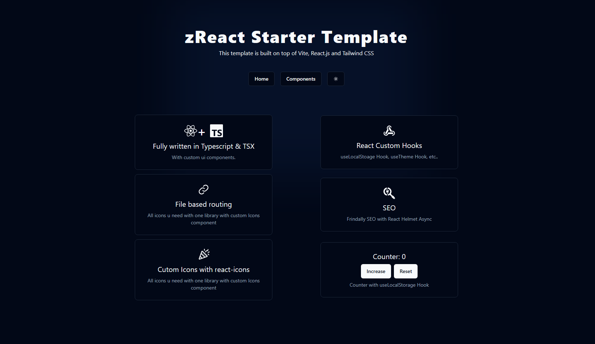
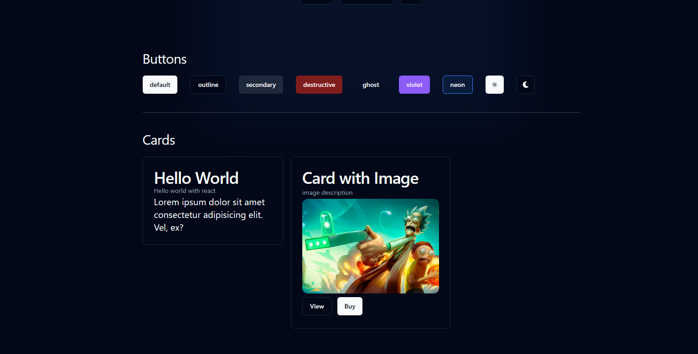

# zReact Starter Template

This template provides a starter setup to get React working in Vite Fully written in Typescript & TSX.

## Features

- Fully written in Typescript & TSX
- Styles using : [TailwindCSS](https://tailwindcss.com/docs/font-size)
- File based Routing : [ReactRouter](https://reactrouter.com/en/main)
- React Custom Hooks : [useLocalStorage](https://reactrouter.com/en/main)
- State Management using : [ReactRedux](https://react-redux.js.org/) ❌
- Frindally SEO using : [ReactHelmetAsync](https://www.npmjs.com/package/react-helmet-async)
- Custom Icons Component using : [ReactIcons](https://react-icons.github.io/react-icons)
- Custom Style Components System : [Buttons, Cards]

## Installation

     git clone https://github.com/M-ZENHOM/zReact-Starter-Template.git
     cd zReact-Starter-Template
     pnpm install
     pnpm run dev
